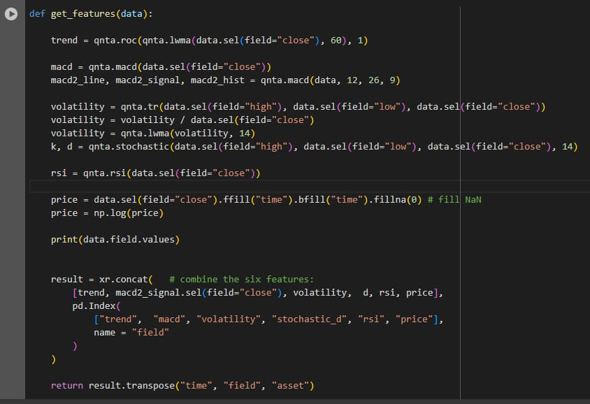

# LAB ATQ - MLPRegressor
Nombre: Juan Sebastian Medina Pinto

Este laboratorio tiene la finalidad de predecir el precio de las acciones de una cartera de acciones.

## Imagen del Sharpe Ratio

## Configuration
* sharpe_ratio: 5.19

* Market : S&P 500

* Assets : ['NYS:ORCL', 'NYS:OTIS', 'NYS:OXY', 'NYS:PAYC', 'NYS:PBI', 'NYS:PCG', 'NYS:PCL', 'NYS:PCP', 'NYS:PEG', 'NYS:PFE','NYS:PG', 'NYS:PGR', 'NYS:PH', 'NYS:PHM', 'NYS:PKG', 'NYS:PLD', 'NYS:PM', 'NYS:PNC', 'NYS:PNR', 'NYS:PNW', 'NYS:POM']

* The variables: I got problems using other variables. In that way I leave the same variables that came with the example code.****

* Changes of features : change the algorithm XGBoost

  ## Imagen del feature 

